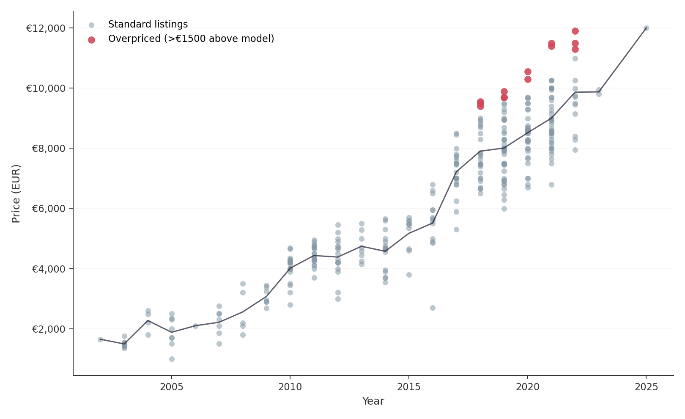

# Overpriced listings on a used-car marketplace

**Problem.** Listing liquidity is a key metric for a used-car marketplace. One driver of low liquidity is an overpriced listing. Question: which Citroen C3 listings are overpriced relative to comparable listings of the same model year and similar mileage.

**Method.** 336 listings collected with a rate-limited scraper (`parser_fiat.py`). Linear regression `price ~ year + mileage_km` (R² = 0.873) instead of a simple year-average estimate.

**Result.** A ranked list of overpriced listings was produced: for example, `car_004` (2021, 108,792 km) exceeds the model's expected price by 2606 EUR. Full analysis, including a discovered extrapolation artifact in percentage-based ranking and method limitations, is in the notebook.

**Full analysis:** [citroen_analysis.ipynb](citroen_analysis.ipynb)

## Files

| File | Content |
|---|---|
| `citroen_analysis.ipynb` | Full case: problem, question, data, analysis, findings, limitations |
| `parser_fiat.py` | Rate-limited listing scraper |
| `citroen_clean.csv` | Cleaned dataset (336 rows) |
| `citroen_with_residuals.csv` | Dataset with model predictions and residuals |
| `price_by_year.png`, `predicted_vs_actual.png` | Charts |
